> You can skip to my portfolio [here](#portfolio).

Hello, I am Fernando Valle, but I usually go under the **ELMFER** penname on the
internet. I'm a guy who is invested into engineering through a path of perpetual
learning. Because I learn a lot of new concepts and technologies, I became
fixated on creating projects with my unique twists using interesting tools, or
even breaking stuff in the interest of figuring out what can be done.

## What I Do

My current primary focus is low level programming on embedded systems and
graphics programming. Utilizing microcontrollers such as the ESP32 and Raspberry
Pico alongside small Linux computers like the Raspberry Pi Zero had helped me to
learn these lower level concepts, often integrating graphics programming as
well.

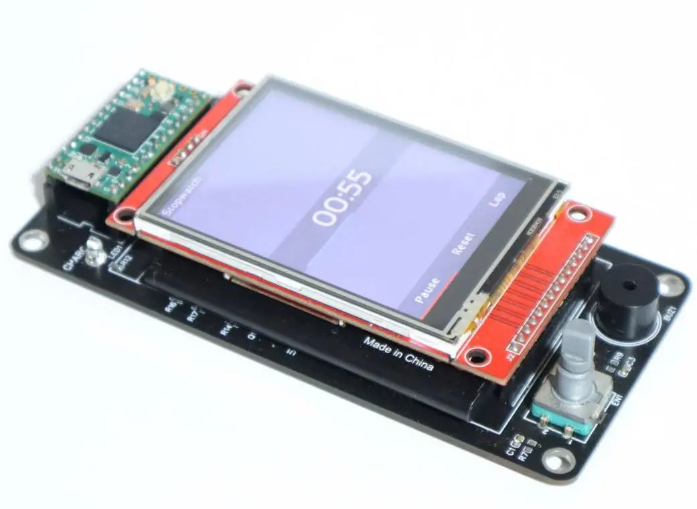

> The Teensy Stopwatch, running a graphical stopwatch application on an
> embedded platform.

In fact, my two largest projects incorporates these concepts. For instance, one
of my latest big projects is CodeNode Microcontrollers, a Minecraft mod that
adds a virtual MOS 6502 microcontroller that can be programmed in assembly,
allowing players to control Redstone with an emulated embedded platform.

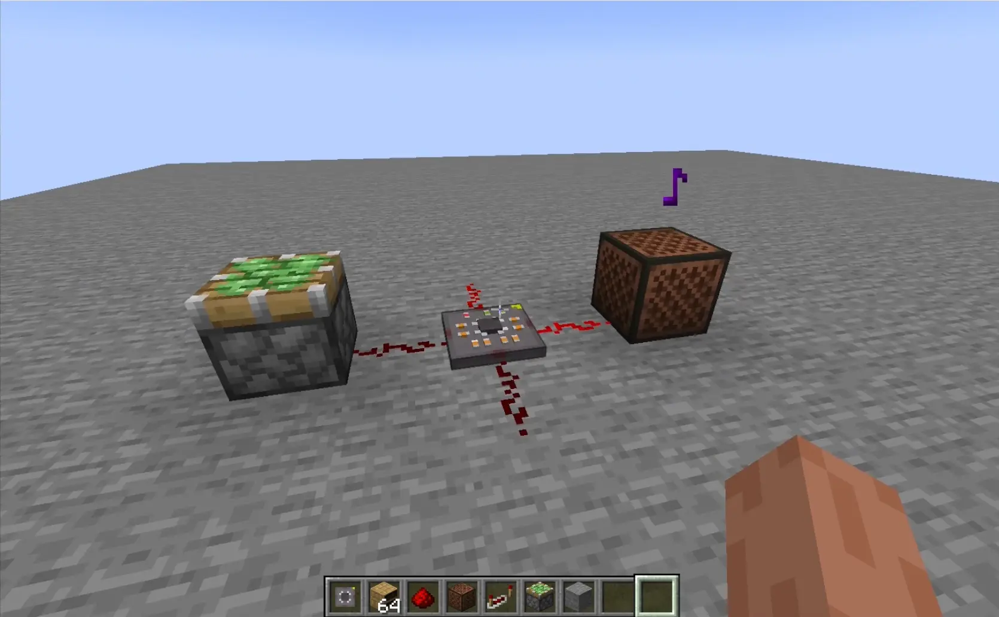

> A micro controller block controlling a piston and a noteblock using the
> `sin` function.

Thanks to Minecraft modding, I had been introduced to graphics programming, and
I find it useful for expressing my creativity in many of my other projects. I
find it interesting because it is a niche intersection of art and programming
because it requires configuring graphics pipelines and writing shaders to make a
computer to draw something unique and dynamic.

For example, my engine simulator project, Engine Music, uses OpenGL to draw an
articulating engine by creating parametric meshes for each part, rendering them
in their proper positions, and applying a clever blending technique to show
motion blur for showing emphasis on the engine's speed.

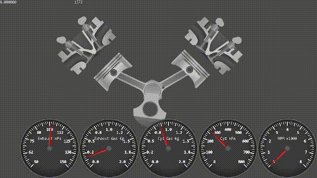

> Engine Music simulating a VTwin engine at 15kHz.

---

## Portfolio

There are various projects that I have worked on that had broaden my scope of
programming. Let me introduce them to you.

### CodeNode Microcontrollers -- Java/C++ Game Modding - Hardware Emulation

An interactive learning platform in Minecraft for embedded systems and bare-metal
assembly development on microcontrollers, utilizing a simulated 6502
processor with I/O peripherals, such as UART and interrupts. The platform
positively impacted hundreds of learners through comprehensive documentation of
the microcontroller's architecture, registers, peripherals, and address space.

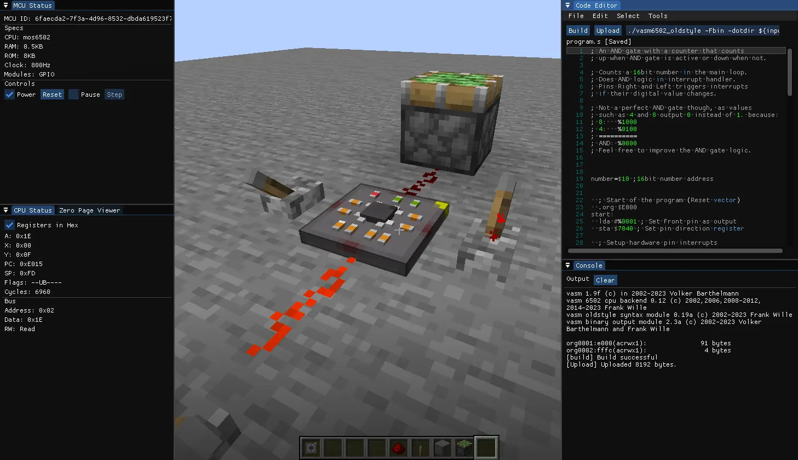

### Engine Music -- Realtime Engine Simulator

A comprehensive internal combustion engine simulator written in C++, leveraging
real-time engine parameters, fluid dynamics principles, Newtonian physics,
OpenGL for visual feedback, and signal processing for audio.

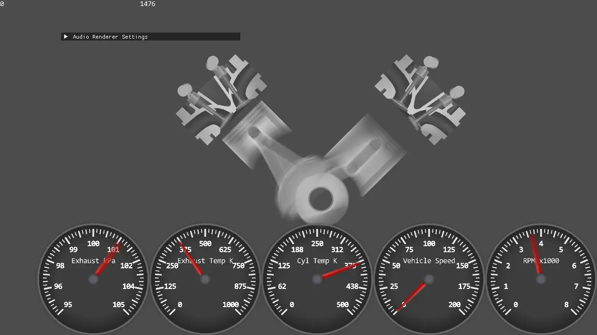

### Parkour Recorder -- Java Minecraft Mod

A quality-of-life mod for add recording and playback features in Minecraft using
Fabric mod loader, OpenGL for dynamic 3D/UI rendering, and animation techniques
such as interpolations and easing.

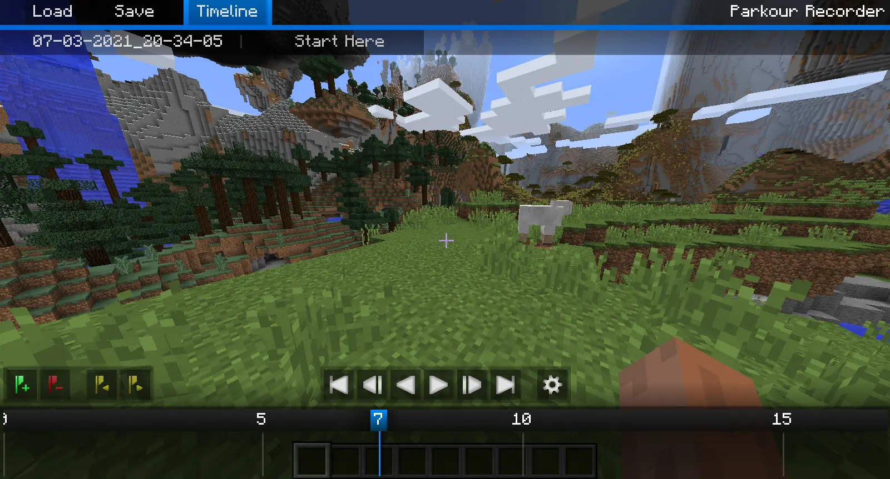

### Teensy Stop Watch -- Embedded App Development

Firmware-based stop-watch application for the Teensy 4.0 microcontroller
attached to a TFT display. Utilized C++ for software graphics font/shape
rendering, Python for font atlas generation, and EasyEDA for PCB design.

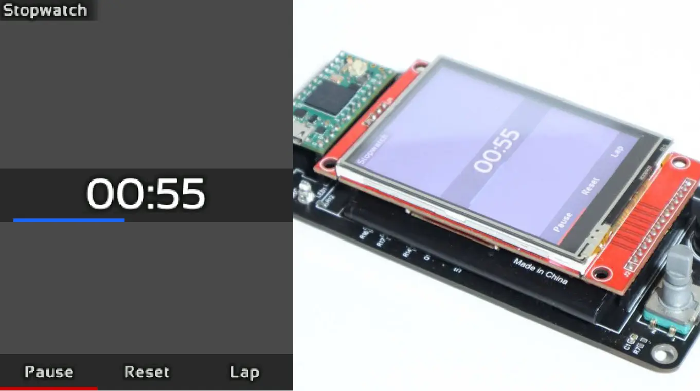

### Workbench Lighting System -- Embedded DC-DC Control

A robust dual-channel workbench lighting system for optimal LED brightness
control. Used low-level C++ firmware to incorporate voltage sensing, PID
controls, and UART for remote monitoring.

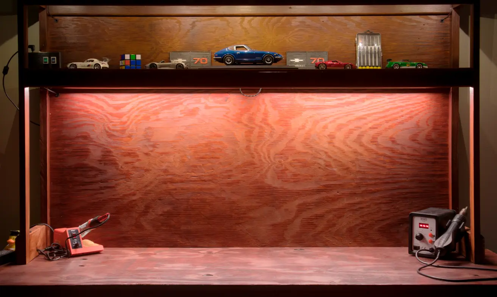

### Workout Placita -- Fitness Tracker

A fitness tracker app that allows a user to login and create their own personal
workout profile. Within their profile, the user can select the type of workout
they want to share and write a description about it. Front-end was created with
React and ExpressJS for the backend server.

### Camera Motion Rig

A camera gimbal that enables smooth camera movements for recording high quality
videos. The system consists of a 2 axis CNC machine with two stepper motors and
an Arduino. It is meant to be mounted onto a camera tripod, and it is controlled
using a remote that contains a screen and a joystick.

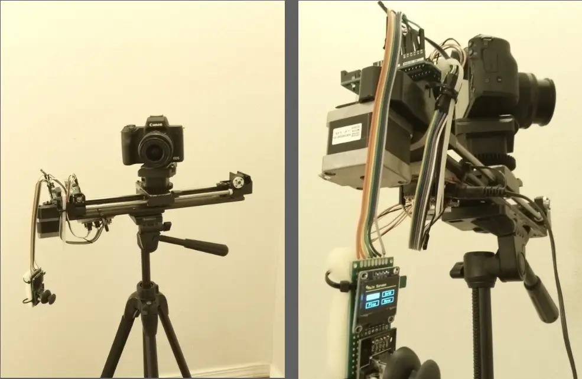

### PSM -- Pitch Shift Music Browser Extension

A small browser extension for Firefox that adds the ability to shift the pitch
of any YouTube video using vanilla Javascript. It enables "relistening" to music
by hearing in a different key than usual.

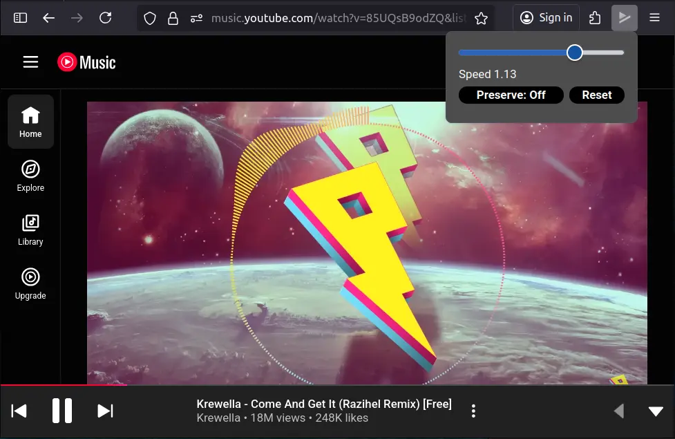

### Neural Network Visualizer

A visualizer of a simple neural network that can be trained to mimic an OR gate.
Created in C++ alongside ImGui for quick input controls, and OpenGL for
rendering the network.

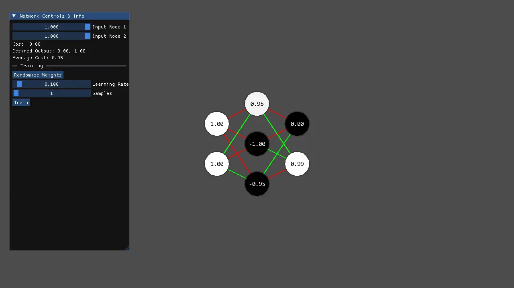

### Minecraft World Saver

In collaboration with my little brother, Minecraft World Saver is a desktop app
that serves to manage and automate backups of Minecraft worlds. It used RayLib
for the app framework and Clay for computing the UI layout.

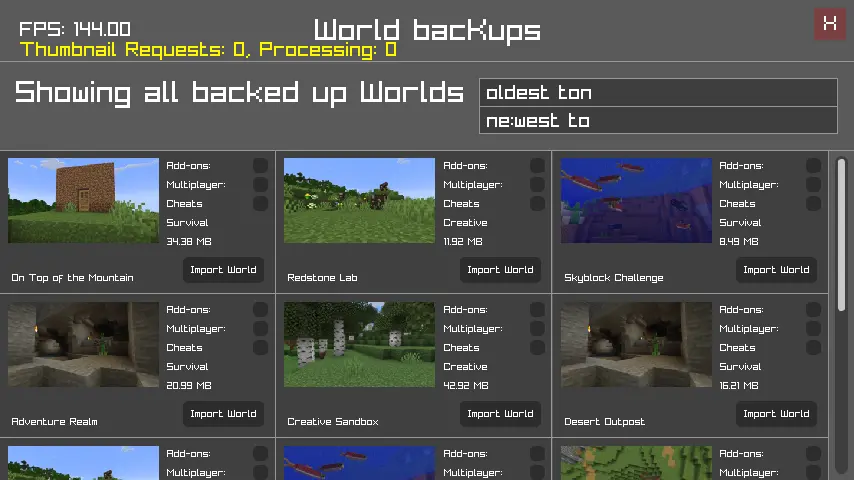

### Hydroponics System Control Panel

A program designed to view and control the status of a hydroponic system
(developed by the student organization S.A.R.E) via a computer. Able to send
commands, visualize the gantry, and use a gamepad for manual control. Created
with C++ and OpenGL alongside a custom framework for drawing UI.

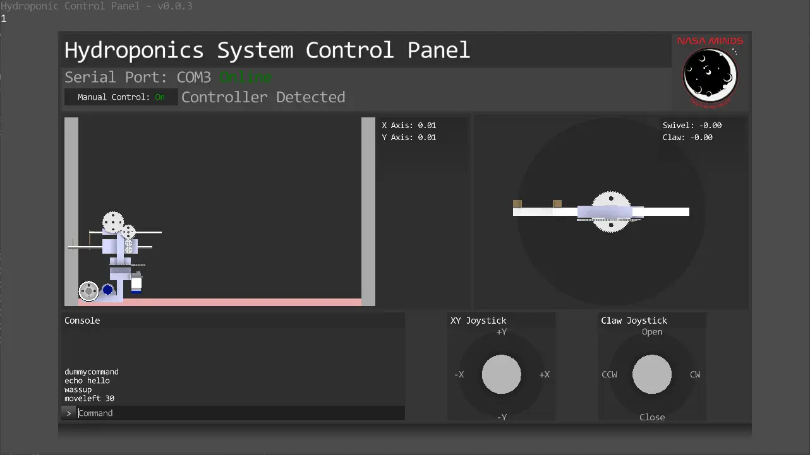
