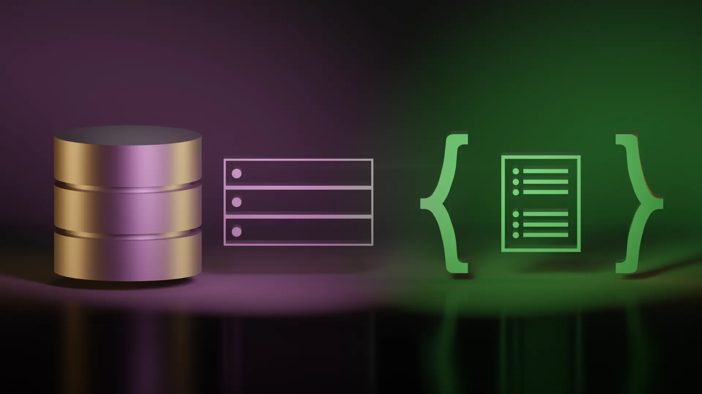

## Prelogue

About year ago, I learned how to create and use a SQL database to store persistent data for a
server. Reason being, I wanted to store a list of files available for download of my Minecraft mod
[Parkour Recorder](https://prmod.elmfer.com). I found it useful that it is a relational type of
database because it has great data integrity; related data are guaranteed to not point to missing or
partial documents. At that time, I knew that NoSQL databases exist, but I thought that those did not
make sense because it is not a standard type of database.

A year later, I started my bootcamp journey at UT Austin. In the ciriculum, we learned both SQL and
NoSQL databases. The NoSQL database we learned was MongoDB, and I was surprised to hear that many
big tech companies use them. But why? I was told that MongoDB is much more flexible than a SQL
database like MySQL, yet I thought that by adding flexibility to it could hinder the integrity of
data; the structure of the data can become chaotic with no rules in place. Nonetheless, it is
required for me to work with it on a few assignments.

## MongoDB JSON Formatting

I was plesantly surpised to learn that MongoDB stores its data very similarly to how you store data
in a JSON file, and since I have a huge preference to JSON, it caught my attention. MongoDB does
infact use BSON, a simliar data format scheme to JSON, to store its data. This is cool to me because
I can store data (like I have always done with JSON) in a similar way, but the difference is that
this can have multiple collections of documents and that this is a server (very much like MySQL)
meaning that I can access it remotely.

As a result, I grasped MongoDB very quickly, and working with it makes me realize its potential to
serve in other projects. Being flexible, it is easy to setup and to work with since MongoDB isn't
strict on schemas and relationships. Additionally, I like how you can query the database using its
shell console. This is done using dot notation which is similar to the syntax used for object
oriented processes like in Javascript.

## Concerns

Nevertheless though, my initial concerns of a NoSQL database turned out to be true. While working
with it in my [Social Media Backend Server](https://github.com/elmfer/social-network-backend), the
relationships between objects have to be explicitly ruled out in code. For example, if a user in
this social media site has posts, you have to make sure that those get deleted if the user gets
removed. This may sound easy to implement, but as you add more objects and relationships, it does
get hard to keep track of all of them at once when writing database queries. On the otherhand, a SQL
database will not allow queries that results in data fragmentation. All you have to do is to define
the objects' relationships one time with an
[ORM](https://en.wikipedia.org/wiki/Object%E2%80%93relational_mapping), and it will automatically
maintain data integertiy as the app is being used.

## Conclusion

In conclusion, I can see MongoDB being used for storing simpler data structures where data
fragmentation is not a big deal. Because they are easier to grasp and easy to setup, they are easy
to implement and adapt into any application. In contrast, SQL databases are rigid and reliable for
data integrity. They do require more planning ahead of time prior to developing an application, but
it automatically disallows any operations that will result in data fragmentation (keeping your data
consistent).

> ### Credits
>
> Stock photos are sourced from [pixabay.com](https://pixabay.com).
