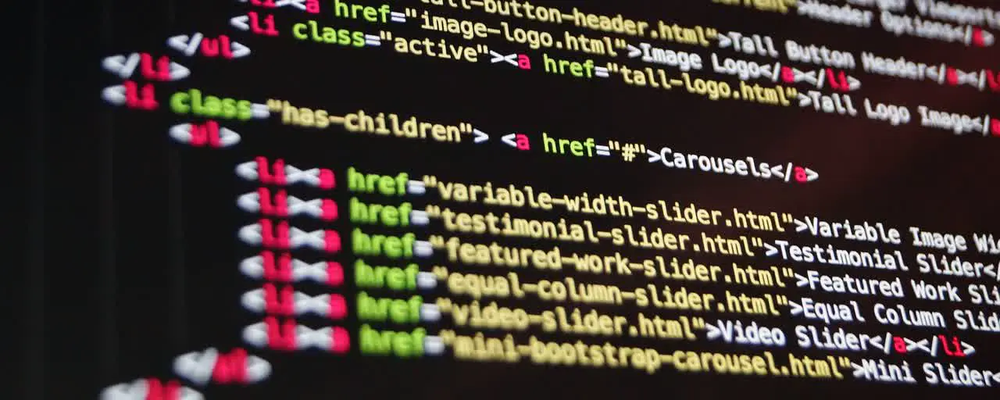

I've created this blogging site to document my journies on my technical projects. However, I regret on not starting it sooner, but at least I am starting now; **it is never too late**. I'll share exactly why I am going through the trouble of starting a blogging site, and I will explain on why new aspiring programmers should start blogging their coding journey as soon as they start their career.

> *“Where the Internet is about availability of information, blogging is about making information creation available to anyone.”*
>
> - George Siemens

[^1]: The above quote is excerpted from Rob Pike's [talk](https://www.youtube.com/watch?v=PAAkCSZUG1c) during Gopherfest, November 18, 2015.

## Where I Started

Back in my freshmen year of high school (year 2016), I taught myself on how to code to the point where I don't have to follow tutorials on YouTube. To me, this is a breakthrough because I dreamt of creating a Minecraft mod. But, realizing all the technologies that this career has to offer, I was curious and wanted to learn more.

This prompted me to think of project ideas that will allow me to expierment with them, so naturally I got familiar with various kinds of programming languages, libraries, and tools. For example, I learned C++ so that I can make code that is performant compared to Java (the first programming language I learned), and I learned the FFmpeg API so that I can decode videos and display them as a texture in OpenGL.

## Realization

Soon enough, I had dozen or so small projects that I had laying around in my hard drive untouched. I never intended for those projects to be completely finished because the goal was to practice using the tech hands-on. Looking back on those projects, I realized that I had actually put a lot of effort into them dispite them being small applications since it required reading documentation, practicing reading other people's code, and debugging many technical errors.

This realization made me think that those projects can add more value to my career if I document them because they serve these three purposes:

* It will guide other people that are dealing with similar problems
* Shows to others and potential employers the challenges I've faced and conqured
* Keeps me accountable by logging the progress I've made and the things I've learned

## It Helps People

There have been instances where other's people posts on how to use a certain library or tool are my savior for finally understanding it and applying it to my projects. If it weren't for those generous people who documented a tutorial, I would have taken a much longer time to solve a problem or even quit all together. However, there also have been cases where I had to figure out something on my own because there were no sufficient documentation on the matter.

I'd spent hours or days focused on solving a single problem, but eventually, I'd manage to solve it. While the breakthrough is beneficial for myself, in truth, all that effort is gone to waste if it is not shared. Someone else could be dealing with similar problems, yet they could have it easier if they had seen what I have done and used to overcome the issue. Therefore, all my efforts could have alleviated the workload of potentially thousands of people.

## Embracing Challenges

Just like learning an instrument, programming takes practice. This requires a high level of passion and perseverance, and it demonstrates to others your ability to problem solve. As mentioned in the previous section, I had encounted many difficulties when it comes to understanding a certain library or tool. Even though I do manage to overcome those issues, it will be hard to prove to other people and employers about my skillset if I have nothing to show for.

It is important to be noble of your career because it is your responsibility to market yourself to people. Being marketable allows you to have an easier time to network, so that way you can meet your potential employer or business partner/s that could elevate your career to the next level.

A long time friend advised me that I am too humble, and he is right because I only keep my programming journey to myself. I rarely share my projects to GitHub nor do I write about them, and dispite being decently knowledgeable and skillful in programming, understandably others may doubt my skillset if I don't demonstrate my projects on display.

## Accountability

Being consistent on your path is important to achieving any long term goal, and programming is no different. However, it is not easy to maintain oneself on path because ... life happens, and there are times where we could stop persuing something simply because we lost interest. One way to hack your brain into being consistent is to have diary that logs everything that you've done. This way, you have an objective view on your progress that you have made so far, and you are more likely to follow through on something knowing how far you've come.

Additionally, if other people see your progress, you will feel more inclined to be persistent because odds are they will be rooting for you. I cerntainly do not want to let others down, so I will feel the need to keep on trying my best.

> ## Credits
>
> Stock photos are sourced from [pixabay.com](https://pixabay.com).
