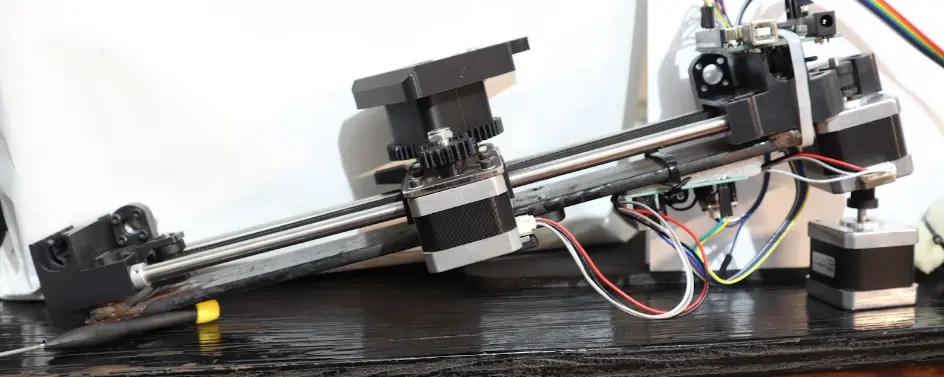
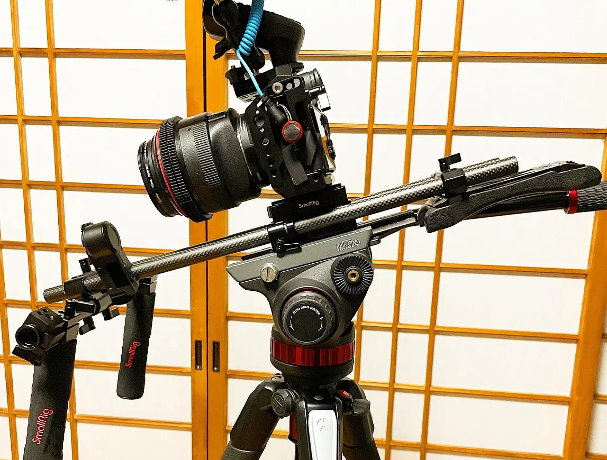
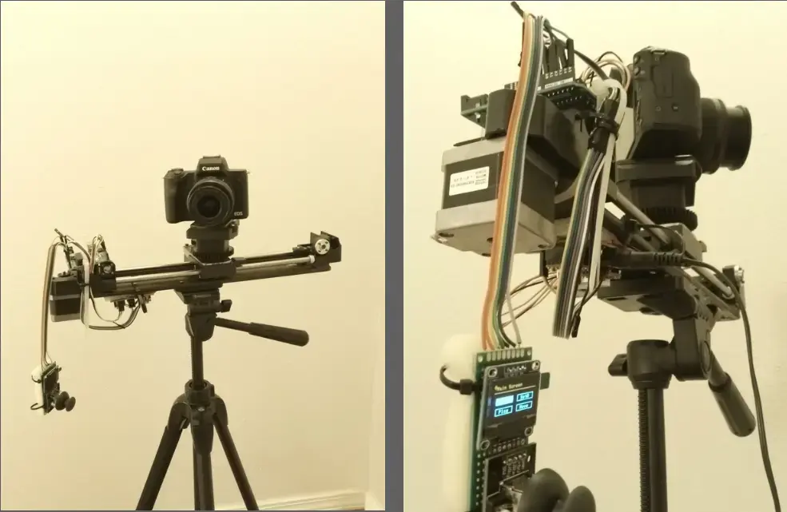
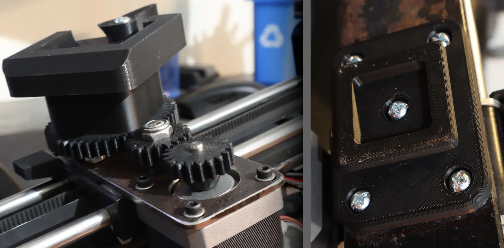
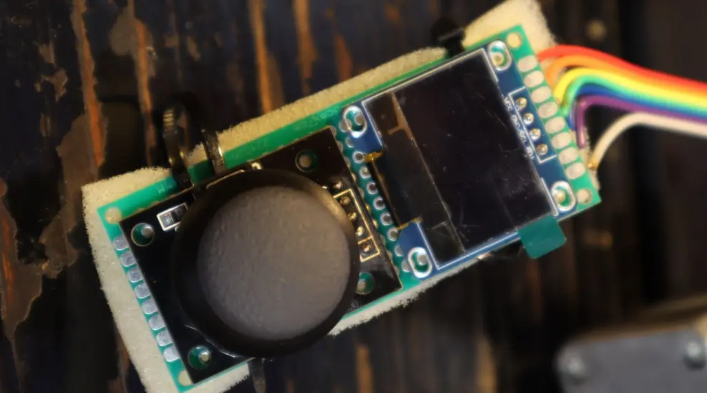
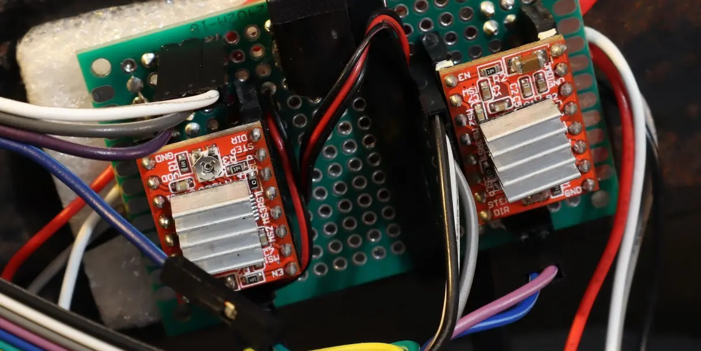
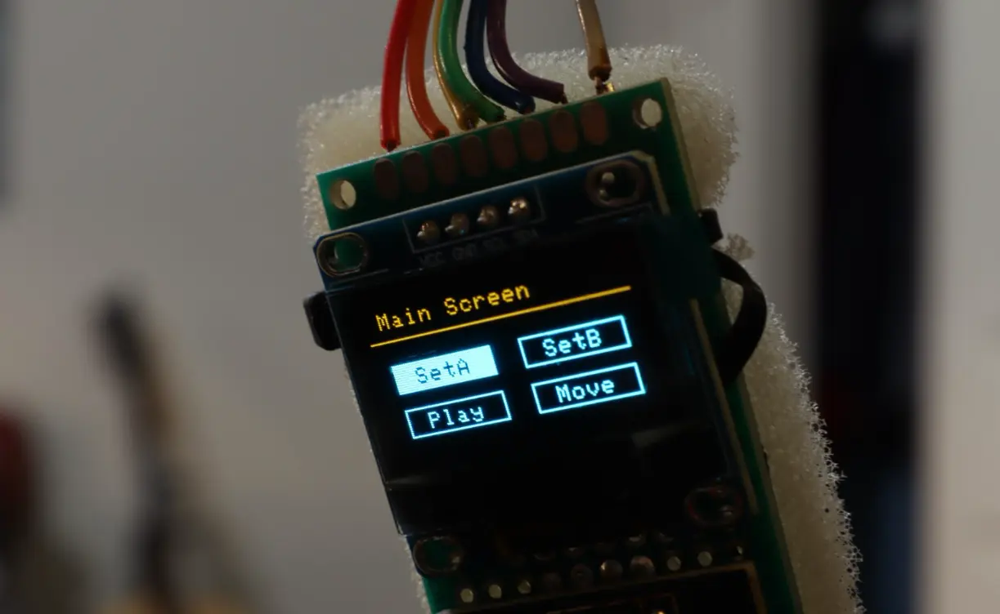
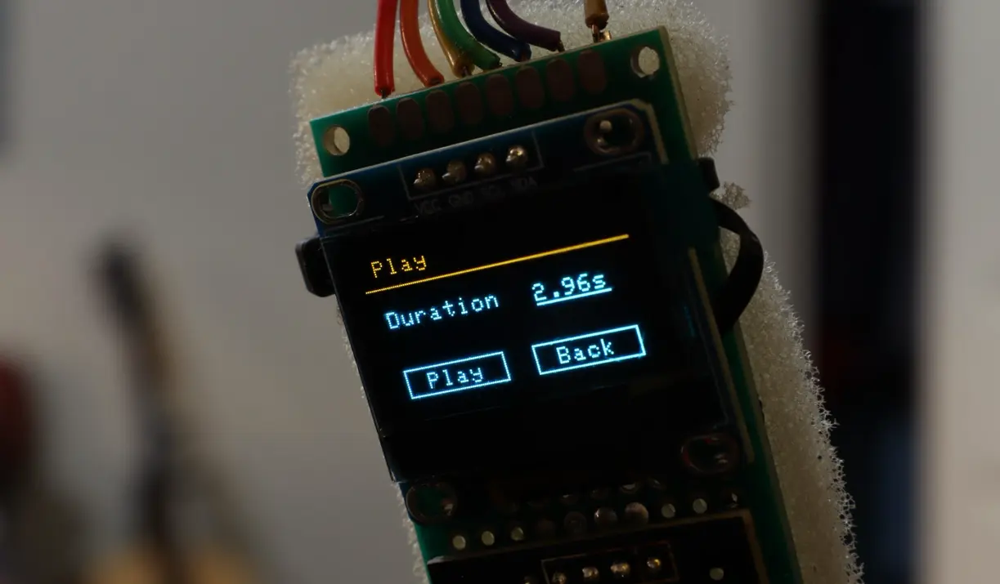

> Article written on 29 Oct 2025

## Prologue

One of my classes at my university assigned my group to create an electronic
device as the final project. Motivated to create a killer, but useful project, I
looked through my bin of scrap parts, and I found a linear actuator from an old
3D printer.

The mechanism itself is fascinating to me because there are so many projects
that could use it for its simple but precise nature. After pondering what could
be the ultimate project to utilize the part, I had a thought about how
frustrating it is to capture cinematic video from my camera.

Most high budget films or established YouTubers have expensive camera rigs
specifically for creating smooth movements using their camera, and it is often
justified because it captures incredible shots, especially for B-Roll or product
closeups. Therefore, my partners and I agreed to recycle this part and had
created the ultimate low-budget camera rig.

## Design

The system is designed like a 2 axis CNC machine that consists of two stepper
motors and an Arduino UNO. The platform that moves has a bracket with a custom
swivel mechanism that can grasp a standard camera mount, and it uses 3D printed
spur gears at 2.42 gear ratio (with an idler gear) to amplify torque of the
motor to allow for more precise movements. Finally, the device is designed to be
mounted onto a camera tripod so that it can work with standard camera setups.

> Swivel mechanism with camera mount (left), and standard tripod adapter
> attached to the bottom (right).

## Interface

Attached to the device is a remote that contains a screen and joystick for
controlling the rig. The screen is an OLED SSD1306 monochrome display module for
showing the user interface where the they can navigate and configure the
machine's movements, or do manual control. For drawing the UI, Adafruit's GFX
library was used to be able to easily draw text, rectangles, and images to the
screen using a simple API, and the rendered images are sent through the
Arduino's I2C serial bus.

## Driving the Stepper Motors

To control the stepper motors, it uses two *A4988* drivers that automatically
sends the required sequence of signals to the motors, capable of micro-stepping
(for smoother operation) and current limiting (preventing motors from burning
up). These circuits are soldered onto a purfboard for creating a reliable
prototyped circuit.

These drivers require pulses to generate the steps, and these pulses occur at
varying frequencies to control the speed of the motor. Therefore, the Arduino
UNO is configured to use two hardware timers, *Timer1* (a 16bit timer), and
*Timer2* (a 8bit timer). These timers, once configured, are able to output a
pulse at a specific frequency for controlling the speed. A direction signal is
also sent to control the rotation direction of each step.

## How to Use

There are two set-points to control the movement, A (the starting position) and
B (the ending position). Once configured, playback can start and the camera will
interpolate between the two points with the given duration. Furthermore, the
"Move" menu enables the user to move the machine manually with the joystick.

> The main menu of the interface to select editing of set-points, starting
> playback, or manual control.

> The "Play" menu giving the user the option to set the duration.

## Results

I was honestly surprised that the Arduino UNO was able to draw the user
interface, calculate smooth movements, handle inputs, and control two motors all
at the same time given that it is a rudimentary microcontroller compared to, for
example, the ESP32. Regardless, the finished project worked wonderfully. Take
look at the footage it can capture:



Overall, I am very impressed with the smooth movements this project offers.
While it may look a little jittery (if you look close enough), it can be fixed
by replacing the spur gears of the swivel machanism with a belt drive for
smoother transfer of power. This can be done in the future, but I am still quite
happy with the project since it works well enough for my use case.

> ## Credits
>
> Stock photos are sourced from [pixabay.com](https://pixabay.com).
