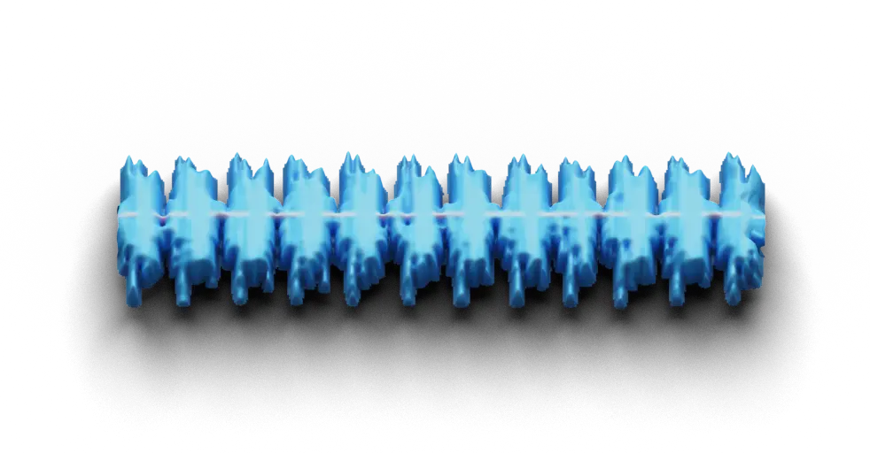
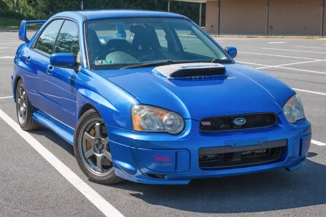
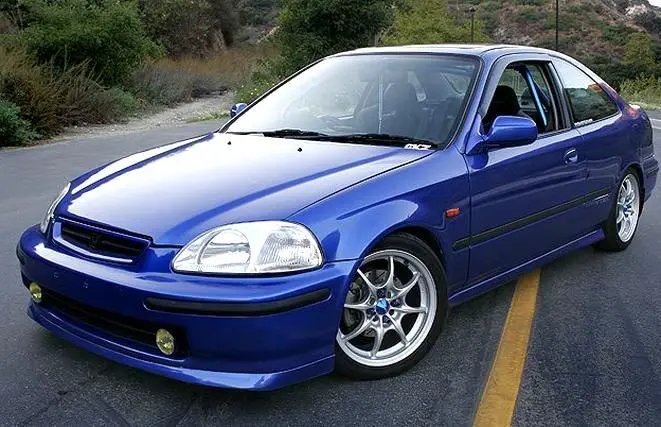
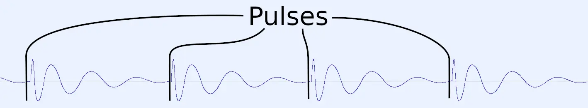
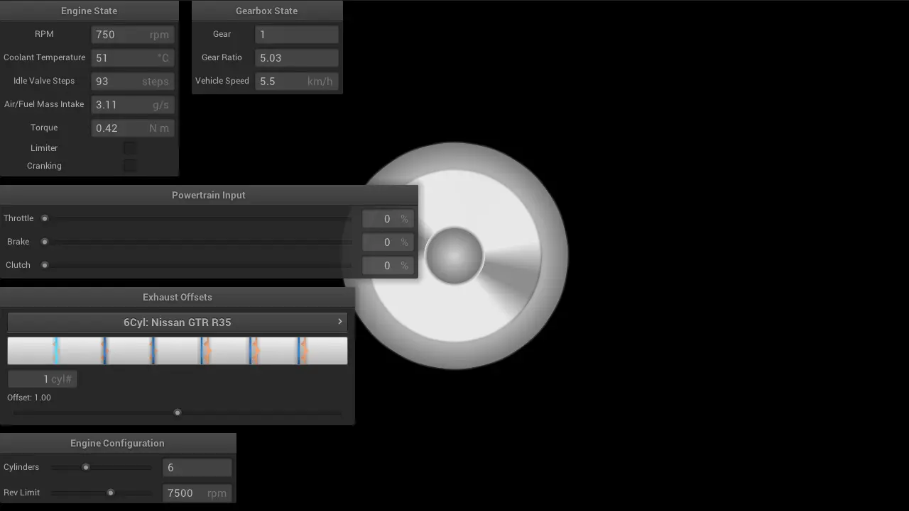
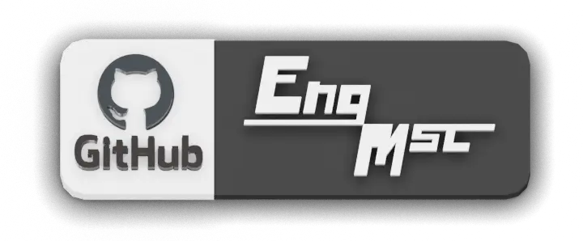

_Revised 25 Dec 2024_

ENGMSC or Engine Music is a C++ library with an audio architecture that contains synthesizers made
for engine sound generation.

## How it Works

We gear-heads may know that an internal combustion engine is simply an air pump. It uses valves and
pistons to pull and push air through it's intake and exhaust side respectively, and combustion from
the air/fuel mixture is what propels the engine. Due to it's nature, an engine does not push air
continuously; it rather pushes air in pulses. Depending on the number of cylinders and exhaust
header configuration, the engine produces different notes from one another. For example, a four
cylinder Subaru WRX with unequal length exhaust headers produces a rumble sound compared to a Honda
Civic with equal length headers.

| Subaru WRX @ BringATrailer | Honda Civic @ Pinterest |
| --- | --- |
|  |  |

ENGMSC simulates those pulses. Each pulses' level and tone depends on factors like temperature and
load, and they are fired for each cylinder. Each cylinders' exhaust length (in ENGMSC, referred to
exhaust offset) will alter the timing of their pulses, so in combination with the engine's speed, it
will produce an engine note.

## Its Purpose

As a gear-head, it's sad to know that eventually all internal combustion engines in vehicles will be
replaced with boring electric motors. There is great pleasure from hearing an engine's roar as you
drive, yet electric ones will just give us a little whine noise – not that exciting. ENGMSC will
provide the concept on practical engine sound generation, as it does not require audio recordings.
Once you know all the parameters, ENGMSC will produce engine sounds that can be used in games and
simulations.

| Datsun 240z @ MotorTrend |
| --- |
|  |

## EngMsc Application Demo

ENGMSC has a demo; it's called ENGMSC-App. It offers you control of a virtual vehicle, and it will
generate its sounds in real-time. ENGMSC-App simulates a vehicle controlled by Newtonian physics,
for it serves an important role to approximate the engine's conditions in order to produce
convincing sounds. It is open source on GitHub alongside with the ENGMSC library, and it is open to
contributions. I was able to compile it for Linux (Ubuntu distro), Windows (with both MinGW and
Visual Studio), and even for the web using Emscripten.

For development on the ENGMSC-App to be easier and faster, it uses a couple of libraries. The
application uses Nanogui for providing a visual interface, GLFW for window creation, Iir1 for audio
filtering, and Assimp for loading 3D models from files.

