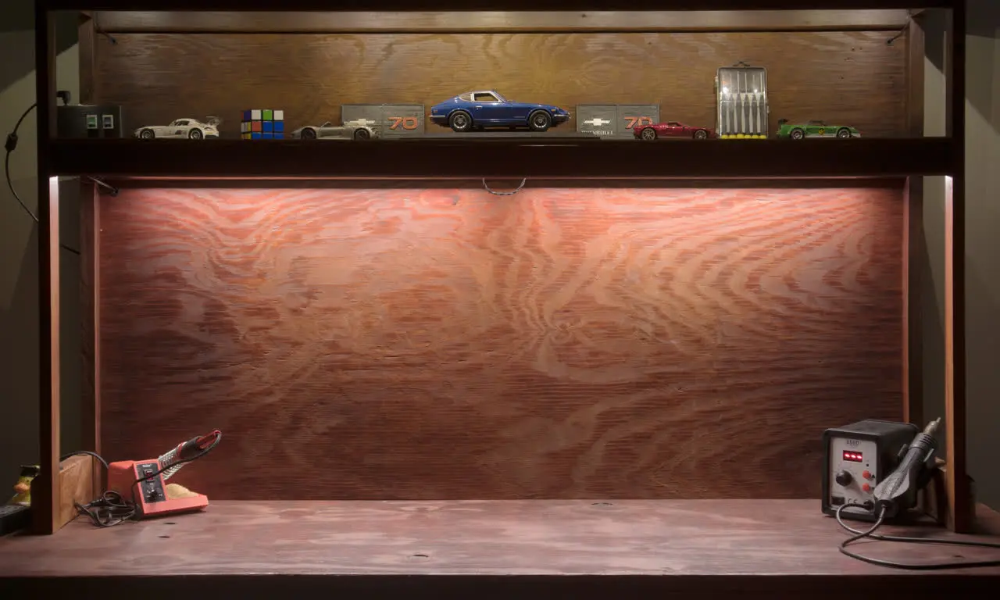

About a year ago, I wanted to have a workbench in my room so I can work on electrical projects
without having to sit down or trade desk space on my computer setup. I asked my dad for his opinion
on how to obtain one without breaking the bank, and he convinced to make one from scratch out of
scrap wood and materials he had laying around. Indeed, building the table is a hard task, yet it was
an opportunity for me to challenge myself on my designing and carpentry skills.

## Construction

To start, I designed the workbench. I drew a rough sketch of the table on paper while keeping in
mind what materials (such as plywood and beams) I had available. Using this sketch, I created the
final design in FreeCAD. It was the first time I attempted to design a wood project in CAD, yet I
found that it is increadibly useful for visualizing the final project while also having the
dimensions down at the same time.

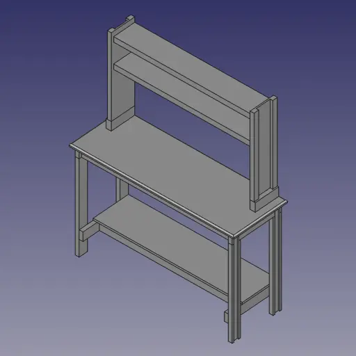

After about a week on crafting the table full-time, it was finished. I am proud of the result
considering the limitations of materials, and I am glad to see that the technique of using wooden
dowels and glue to create seemless joints worked perfectly. For the final finish, I painted the
entire desk with redwood stain from Home Depot using a paint gun. The paint gun helped with applying
the stain equally across all surfaces, and it also enabled me to purposly over-apply on certain
areas of the table to give them a gradient around the edges.

## Lighting

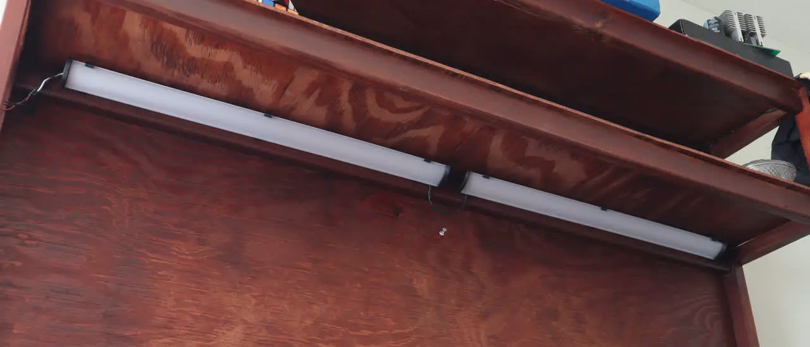

While it looks great, I wanted to add lights to the workbench so that the work area is well
illuminated. I luckily had two broken LED fixtures that are meant to be installed in kitchen
cabnets. Testing the LEDs by applying 31 volts results in them working with promising brightness, so
luckily it is just the fixture frame that is broken, neat! I also had LED fairy lights that can
illuminate the upper and lower deck of the table for extra flare.

Using my 3D printer, I fabricated mounts for the LEDs. For the cabinet (main) LEDs, I simply
designed a bracket that mimics the original fixture's profile that supported the LED and diffuser.
To protect the ends of the diffuser, I made caps that fit snuggly at the ends of it. For the fairy
lights, I designed a simple bracket to where a single LED slides into it as such in the photo.

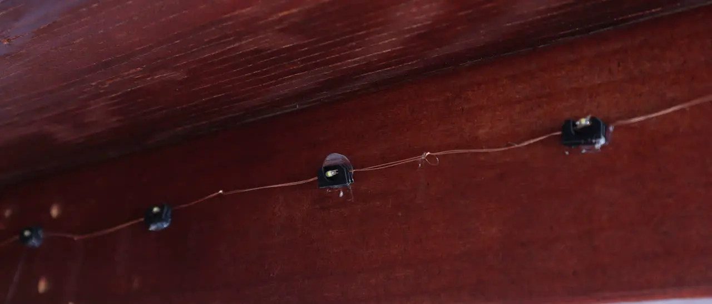

## Circuitry

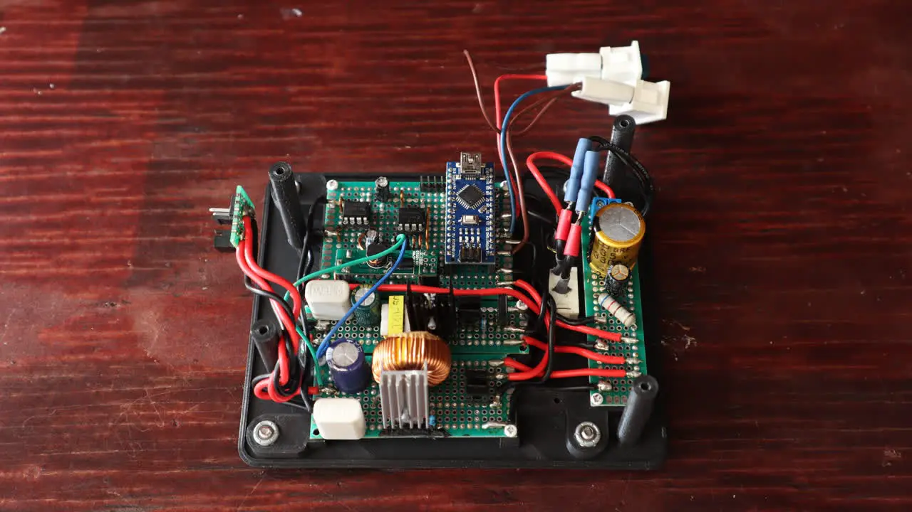

After mounting the LEDs, I spent two weeks researching, testing, and designing circuits the will
drive them.

The simplest way to control voltage is to directly send the PWM to the lights, but there are two
problems to this. First of all, PWM actuated lights are flickery and are uneasy on the eye.
Secondly, the input voltage for the entire system is 19v (supplied by a 60w laptop charger). Thus
19v isn't enough for the main LEDs which have ~31v forward voltage for decent brightness, and 19v is
way too much for the auxilary LEDs which require ~3.4v.

To resolve this problem, the circuitry is using one boost converter (for increasing voltage) and one
buck converter (for reducing voltage). These converters control the main and auxilary LEDs
respectively. These are perfect for the lights because they output a steady voltage (so no
flickering), and they can control thier output voltage via adjusting the duty cycle.

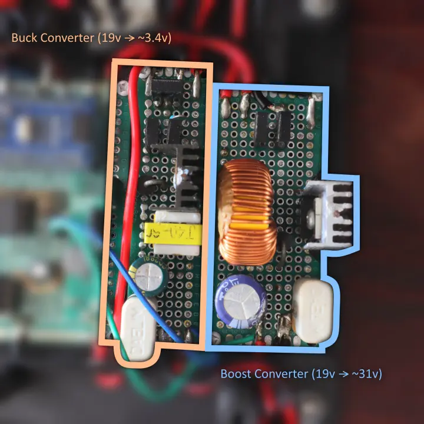

The lighting circuitry is controlled by the Arduino Nano development board which uses the ATmega328P
microcontroller. Thanks to the Arduino development kit, programming the microcontroller is easy
because it contains easy to use functions to control the I/O pins.

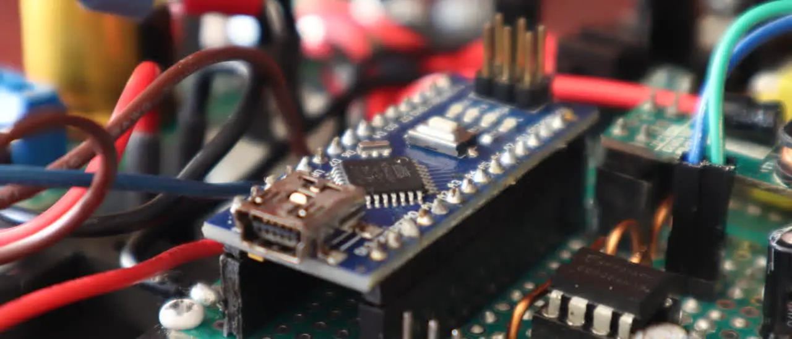

Its main job is to produce a PWM signal to the two voltage output channels to control the brightness
of the lights, and furthermore, it has protections against overvoltage and high PWM duty cycles to
the circuits.

After concluding research and testing, I made the final design of the entire circuit including the
Arduino. In the final schematic, the brightness (voltage) of each channel can be adjusted via thier
respective potentiometers, and they can also be disabled by flicking thier respective switches
aswell.

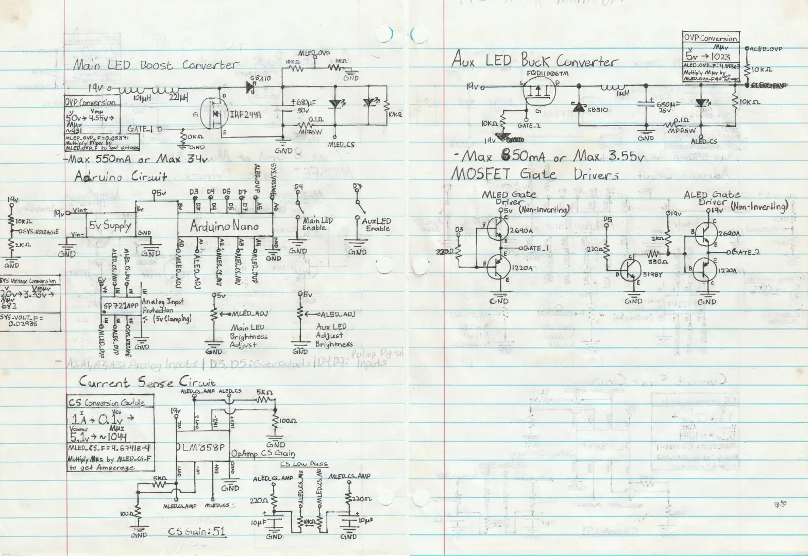

From what you've seen in the previous photos, the circuity is created entirely on protoboards. All
the elctrical components are recycled out of old or unused electronics, and this made the cost of
building the circuit essentially free. To properly plan the layout and wiring of it, I printed a
scaled-up version of the purfboard on paper, and I sketched the components and wires following the
grid of the board. I realized that planning prior to soldering is incredibly important, for the
resulting complexity of the circuits makes it hard to place and wire everything on the spot.

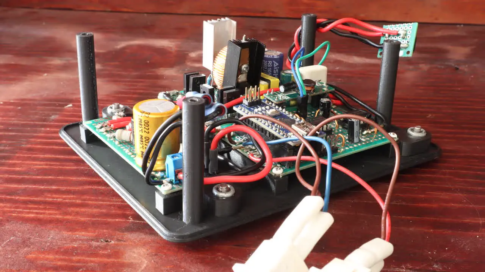

## Programming the Arduino


Programming the Arduino is cruicial for bringing the circuits to life. I simply used the Arduino IDE
and SDK functionality to ease the use when interfacing with the microcontroller.

Prior to the setup code, I abstracted the circuits' functionality by writing the `LightCircuit`
class. This is part of the DRY principle where you don't rewrite the same code for it to work on
multiple instances.

In the setup code, I initialize the two circuits by setting their parameters like the digital and
analog pins.

```cpp
LightCircuit mainLED;
LightCircuit auxLED;

void setup() { // Set the analog input pin to measure voltage (for the feedback loop)
mainLED.setupVoltageSense(A4, 0.05376); // Do the same but for adjusting output voltage
mainLED.setupAdjustments(A0, 27.0f, 33.0f); ... // Do the same for the auxilary channel
auxLED.setupVoltageSense(A5, 4.8876e-3); auxLED.setupAdjustments(A1, 2.65f, 3.6f);
}
```

Through trial and error, I tune the protection and [PID controller](https://en.wikipedia.org/wiki/Proportional%E2%80%93integral%E2%80%93derivative_controller)
functionalities of the circuit aswell.

```cpp
// Max output voltage of 34v and max duty cycle of 70%
mainLED.setupProtection(34.0f, 180);
// Set PWM output pin and voltage feedback tolerance
mainLED.setupPWM(3, 0.25f);
// Tune the voltage controller
mainLED.setupPID(1.0f, 4.0f, 0.0f, 100.0f);
```

Lastly, the `loop()` function gets called repeatedly. We want to execute update commands to the
circuits for them to control the voltage continously, and I also made it print out the state of the
entire system every 250ms for debugging purposes.

```cpp
void loop()
{
    // Disable the circuits if the supply voltage falls out of range (and potentially risk damage)
    float sysVoltage = sysStatus.getVoltage();
    if(sysVoltage < 11 || 13 < sysVoltage)
    {
        mainLED.setEnabled(false);
        auxLED.setEnabled(false);
    }
    // Else, disable the circuit if their respective switch is off
    else
    {
        mainLED.setEnabled(sysStatus.isSw1On());
        auxLED.setEnabled(sysStatus.isSw2On());
    }

    // Update the circuits` target voltage set by the user
    mainLED.updateAdj();
    auxLED.updateAdj();

    // Every 26ms, calcuate and set the output voltage to the circuits by adjusting the PWM duty cycles
    if(26 < now - lastUpdateTime)
    {
        mainLED.updatePWM();
        auxLED.updatePWM();

        lastUpdateTime = now;
    }

    // Every 1/4th of a second, print the status of the system to serial
    else if(printingEnabled && 250 < now - lastPrintTime)
    {
        mainLED.printStatus("MainLED");
        auxLED.printStatus("AuxLED");
        sysStatus.printStatus("System");
        Serial.println();
        lastPrintTime = now;
    }
}
```

You can view the entire source code of this project at my GitHub repository: [workbench-
lights](https://github.com/elmfrain/workbench-lights).

As an update to this project a year later, I had to use another power supply because the original
one (the 19v laptop charger) was needed somewhere else. Luckily found a similar power supply during
a dumpster dive, yet it can only supply 12 volts.

Nevertheless, through another session of trails and errors, I was able to tune the circuit to work
with 12v aswell. The 12v version of this code is accessible at the `using12vPower` branch in the
GitHub repository.

## Enclosure

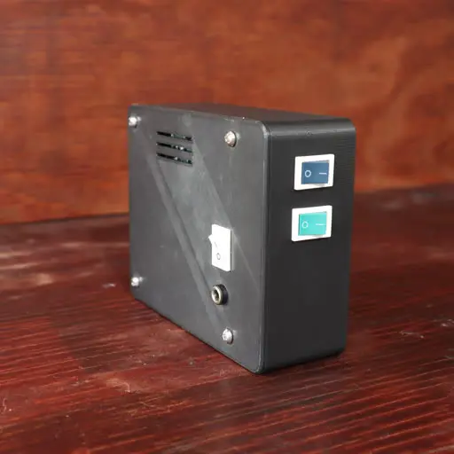

So I got the entire circuit to work, but now it is time to make the enclosure. Before I started
working on the enclosure, I designed a 3D printed base for all the boards to mount on. This helps
with laying out the circuits, and it will determine the placement of all the components on the
outside.


I measure the dimensions of the entire thing to figure out the smallest size of a box I could create
while being able to fit everything inside. Since the boost and buck converters can get warm, I added
ventilation vents near the place where they are going to be located. Lastly, I created cutout for
all the components that are going to poke outside.


All that's left to do is to 3D print them using my Ender 3 printer. I used PLA plastic because it is
the easiest material to work with when 3D printing since it doesn't require a high temperature nor
does it warp.

I am pretty happy on how it turned out:

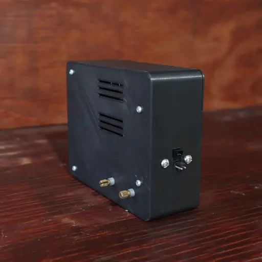

## Setbacks

While I am glad that this project turned out better than I expected, there were a couple of times
where I felt that I wanted to pull my hair out when creating this project.

### Converter Circuits

Since it was my first time creating such a circuit, I did not know enough of it to be able to evade
the curveballs it threw at me. First of all, the MOSFETs I was using kept overheating because I'd
send a full 19v to its gate (which is not good). After doing some research, I found out that it is
also nesessary to use MOSFET gate drivers so that it doesn't overheat from slow charges and
discharges (especially at high PWM frequencies).

On top of that, the inductors I was using were not fit for the job because it kept overheating
aswell. I knew that I needed a high enough impedence for the converters to work effectively, yet the
ones I have uses very thin copper that heats up too much from its high resistance. I had to salvage
one from a 400w PSU that had high impedence with low resistance. I wish I'd knew this sooner.

### Current Sensors

The original idea for controlling the LED's brightness was to control its current draw instead of
its voltage. This is because LEDs are less intuitive to control based on voltage because of its
forward voltages, non-linear brightness curves, and variying behavior from change in temperature.
Additionally, protection against over-current is better achieved if its feedback was the actual
current draw.

After creating the circuit and doing trails and errors, these sensors failed to give an accurate
current draw, and I've concluded that controlling the LEDs via voltage is better in this case.
That's why in the circuit's design, there are current sensors with shunts and operational amplifiers
to measure the current of both the main and auxilarary LEDs, but sadly, the current sensors remain
dormant in the final product.

### Erratic Analog Inputs

This project uses a couple of analog input pins on the Arduino. So when I try get their values from
each channel, it should give me the appropriate values of each. However, I instead get boggus
values. Upon further examination, I realize that values of every analog channel gets mixed up with
the others causing me to believe that the Arduino fails to sample the correct channel at times.

After doing some research, I found out that this is a common problem with Arduinos. Luckily, it is a
simple fix which is writing `analogRead()` twice on each analog channel. This ensures that the
analog multiplexer is correctly routed to the expected channel before sampling the voltage. Check
[References](#references) to find the forum post that sorted this confusion.

## Conclusion

Creating this workbench was an interesting journey. Not only was I able to refresh my carpentry and
CAD designing skills, I had also learned more about electrical circuitry with the voltage boosters
and current sensors. Additionally, I found out that many circuits are able to be built using
repurposed components sourced from old or unused electronics, and it enabled me to workout my
creative and logical thinking that helps with problem solving in the future.

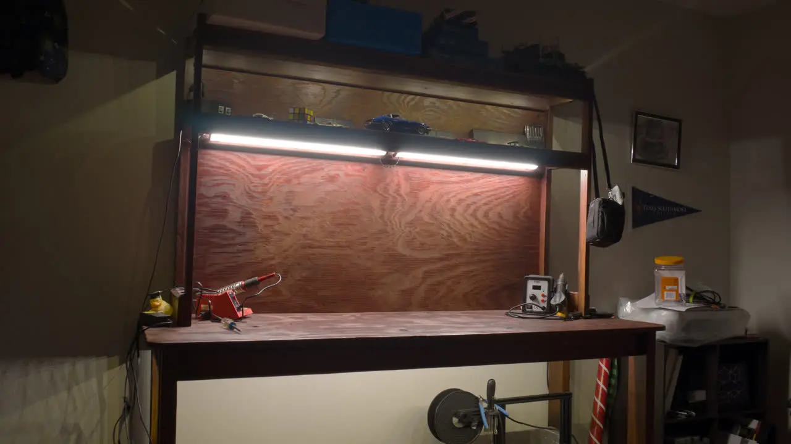

> ### References
> Boost Converter
> * [Video From Electronoobs](https://www.youtube.com/watch?v=nQFpVKSxGQM)
> * [Video From GreatScott](https://www.youtube.com/watch?v=QnUhjnbZ0T8)
>
> Buck Converter
> * [Video From GreatScott](https://www.youtube.com/watch?v=m8rK9gU30v4)
> * [Video From Electonoobs](https://www.youtube.com/watch?v=SM5qPrOrDrc&pp=ygUbZWxlY3Ryb25vb2JzIGJ1Y2sgY29udmVydGVy)
>
> Current Sensor
> * [Article From Instructables](https://www.instructables.com/DIY-Current-Sensor-20/)
>
> Troubleshooting
> * [Eratic analog input with Arduino, `analogRead` must be read twice - Arduino Forums](https://forum.arduino.cc/t/is-reading-and-discarding-first-read-value-still-required-for-analogread/548741)
>
> Adjusting Arduino PWM Frequency
> * [Article on eTechnophiles](https://www.etechnophiles.com/change-frequency-pwm-pins-arduino-uno/)
