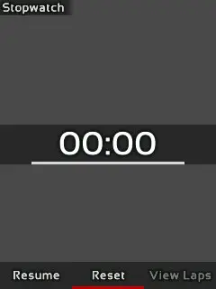
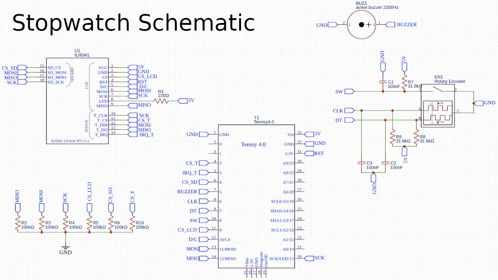

*Revised 25 Dec 2024*

The Teensy Stopwatch is a DIY device that uses the Teensy 4.0 micro-controller for displaying and running a little
stopwatch app onto an TFT LCD module, if as if it were a smartphone.

> Credits to [xsxeth](https://www.instagram.com/xsxeth/) for taking the photos of this project!

## How it Works

Since the Teensy 4.0 micro-controller has a powerful ARM Cortex processor with 1 MB of ram, it is
totally feasible to create a responsive user interface with it.

It has enough memory to store a 320x240 colored image, and this allows the application to buffer the
user interface into it for faster performance as opposed to writing to the LCD module for every draw
command which can be slow. In order to send this image data to the LCD to display, it uses the SPI
interface. The Teensy micro-controller has hardware accelerated implementation of SPI, therefore,
this allows an asynchronous transfer of data to the screen without occupying the processor's
computational power.

### Display Buffering & UI Rendering

Nonetheless, implementing an efficient driver for the module is an intimidating task, for the module
and SPI interface has many technicalities to be aware of in order to use them efficiently.
Fortunately, vindar from GitHub as already developed a sophisticated driver that does all the heavy
lifting for us. The only things we need to do is to allocate memory for our frame-buffers (images
that it is going to display) and to command an update to the driver whenever our image is ready for
display. This driver has dramatically simplified the development process for this project.

**ILI9341_T4 Driver by vindar @ GitHub**

For this project, I've decided to create my own UI code, but user interfacing is not easy,
especially if you have to code its functionality from scratch. However, from what I learned from
modding Minecraft, it can be simplified enough in order to not practically reinvent the wheel. What
I did is create a module called `UIrender` that has a list of drawing commands that can be executed
in the application in order to draw interfaces. The most important commands are, `drawQuad`,
`drawGradientQuad`, `drawString`, and `clear`.

> **UIrender Module Commands**
>
> * `drawQuad` draws a quad by specifying its boundaries (left, top, right, and bottom) and its color.
> * `drawGradientQuad` similar to last, but specified with two colors to create a gradient.
> * `drawString` draws text by specifying the text to display, its position, size, and color.
> * `clear` clears everything with a specified color; it is used for creating a background.

### Text Rendering

`drawString` is complicated because it uses many textured quads to display text, but how does it
exactly work? For this, I give credit to a YouTuber named __ThinMatrix__, for he showed a method on
how to display text for games without using a game engine.

> [Check out ThinMatrix's video on text rendering by clicking here!](https://www.youtube.com/watch?v=mnIQEQoHHCU)

We need is an atlas (image texture) of all the glyphs of a font and a list containing positions,
offsets, and boundaries for all the corresponding glyphs.

All this data can be extracted from a font by using a program called Hiero, and the data is then
converted into a `C array` using Python so that is can be stored within the source code.

With all this font data, we can now display glyphs. The first thing the module will do is to split
every character in the string (of text) into a list of characters. For each character, it then
searches from the list extracted from Hiero for its width, height, offsets, and its location on the
atlas. Each character will then have a quad drawn with its glyph texture extracted from the atlas,
and then the module will move its cursor by the width of the character drawn. This is done to all
elements in the list which results into having text drawn.

### User Input

Now we have a way to display a user interface, but the program needs to be able to respond to
inputs. The Teensy Stopwatch has a rotary encoder that sends a signal when its knob is rotated or
when its switch is pressed, yet due to it's “bouncing” tendencies, I used a Debouncer to remove any
signal abnormalities in software for input reliability.

I created a module called `Input` that polls for input changes every frame. With this module, you
can add `listeners` (code that executes from an event), so when the user, for example, presses the
switch, the module will execute all the `listeners`' code that responds to a switch press. This
event driven system allows you to be able to interact with UI elements, and it simplifies user
interactivity as opposed to listening signals manually.

At last with the modules `UIrender` and `Input` written, we can code basic “screens” that the user
can use. A `screen` element should be able to respond to input, draw a user interface, and handle
any internal logic (e.g. change screen when switch is pressed).

## Usage

There are three screens for this project, `Select Screen`, `Stopwatch`, and `Timer`. On upon
startup, the user is met with the `Select Screen` screen. The user can choose to use either the
stopwatch or the timer functionality.

**Stopwatch Screen**
| Display | Explantion |
| --- | --- |
|  | Using the Stopwatch screen, the user can start the clock by pressing `Resume` and stop it by pressing either `Pause` or `Reset`. |
|  | While the clock is running, the user can press the `Lap` button to record the exact time it was pressed. |
|  | Upon stopping the clock, the user can then press the `View Laps` button; this will allow the user to scroll through all of the laps recording showing their time and duration by turning the rotary encoder. |
|  | Lastly, the user can press the Reset button to reset the clock back to zero, and it will also clear the list of laps recorded. |

**Timer Screen**
| Display | Explantion |
| --- | --- |
|  | Using the Timer, the user can set a duration to which the clock will count down from. The user can press the `Set` button to show a menu to set the timer. In this menu, the user can select `10m`, `1m`, `15s`, `1s`, and `Done`. |
|  | The user selects the option and then uses the rotary encoder clockwise or counterclockwise to increment or decrement the timer respectively. When done, the user can use another option or press `Done` to set the timer. |
|  | When the clock is started by pressing `Resume`, it will count down until either it is paused or when the clock reaches zero. When the clock reaches zero, it will trigger the buzzer on and off every half second until the user presses `Stop` to which the clock resets to the set duration. |

**Screen Selection**

| Display | Explanation |
| --- | --- |
|  | In order to change the functionality while in the `Stopwatch`, or `Timer` screen, the user must hold the switch for three seconds until the `Select Screen` screen appears. The user may then select and change the functionality of the stopwatch. |

## Construction

During the development of this project, all the hardware was connected using a breadboard and jumper
wires.

For the LCD module, I need to be aware that it can perform erratically if their wires connecting to
the micro-controller is long. This is a result from induction formed when current passes through a
wire; induction can reverberate the signal because the current cannot be switched on and off
reliably at speeds of 30 megahertz (the speed which the module communicates with the micro-
controller). This problem is mitigated by using short wires and by decreasing the speed in which the
module is communicating at. Additionally, the LED pin of the module is connected to 5V using a 220
ohm resistor.

The rest of the components are also connected to one of the Teensy's pins. For example, the rotary
encoder has the A, B, and C pins connected to the micro- controller. Furthermore, since the rotary
encoder is just a module with three switches (they can only open or close a circuit, not send 0v or
3.3v), each input needs to be pulled up to 3.3v with a 1k ohm resistor in order for their inputs to
be readable to the micro-controller. For the buzzer, the positive pin is connected directly to the
micro-controller.

I initially tried to put this project on a perfboard, but unfortunately, it was a mess since making
all the necessary connections on a tiny space manually made the circuits unreliable. I instead
decided to design a custom PCB for this project because I could then add a Li-Ion battery to power
this project in a compact package. I learned how to use a prototyping program called __EasyEDA__ to
design the PCB for this project.

First, I needed to create a schematic of the project by following what I did on the breadboard.
However, I did not know how to create a circuit for the battery. Fortunately, I found a YouTuber by
the name of __GreatScott__ who has a video showing on how to create a battery circuit. It was a
standalone circuit originally meant to be used as separate PCB module, but it was easy to implement
it with the rest of the project.

> [Check out GreatScott's video about his battery circuit by clicking here!](https://www.youtube.com/watch?v=Fj0XuYiE7HU)

When this schematic was finished, I can then import it into a PCB editor within EasyEDA to layout
all the components and connect all the circuitry. I additionally created a logo for the project onto
which it is printed on the back of the PCB because it looks so cool!

Once I finished designing the PCB, I sent the design to a PCB manufacturer __JLCPCB__. They where
able to manufacture it in within a week, and it was shipped to my house in about 2 weeks. Lastly, I
made a spreadsheet called a BOM containing all the components that I am going to install onto the
PCB; this was used to order all the materials needed by this project.

Assembling the project was a little daunting because I needed to solder small surface mount
components (like resistors) which can be tricky. Nonetheless, by using some solder flux aided with
the soldering process, and, along with the BOM, I successfully assembled the project. What a
thriller!

> Just a fun fact, the battery for this project is actually salvaged from an old phone!

## Its Purpose

I have been fascinated on how our computers work after I learned some programming, so naturally, I
got curious on how the hardware worked. I discovered Arduino, which is a micro-controller
programming environment and a manufacturer of some micro-controller boards such as the Arduino UNO.
Once I got a hold of an Arduino kit, and, after tinkering around with it, this gave me an idea!

I knew I had to try to attempt making a basic app using an embedded system which led me to this
project. This journey has taught me so much because I had to understand how electronics work, how to
design PCB's, how to assemble them, and also knowing the limitations of an embedded system (such as
limited RAM or computational power). Additionally, since the Arduino programming environment uses a
C like language, that has also taught me on how to be a better programmer by teaching me exactly
what goes on behind the scenes such as memory management, compilers, and preprocessing.
